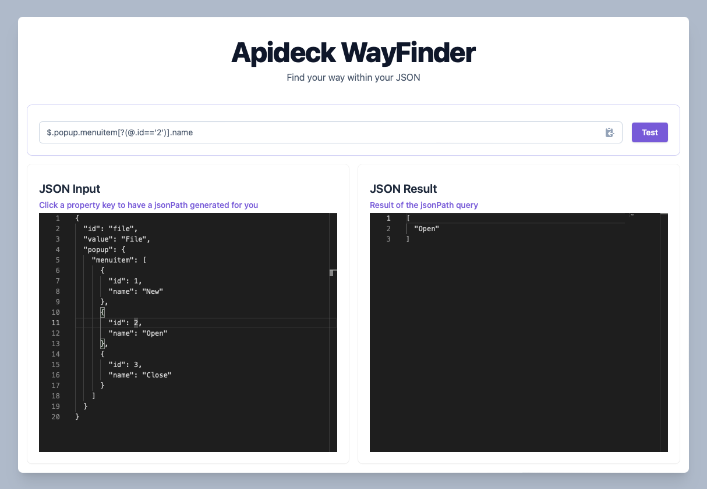

# WayFinder

WayFinder is a TypeScript-based application that helps you navigate through your JSON data. It provides a user-friendly interface for navigating / querying your JSON data and building JSONPath expressions.

## Using WayFinder

1. Place your desired JSON in the left pane.
2. To build a JSONPath, simply click on any key within the JSON data. This will automatically add it to the JSONPath.
3. If you aim to target an item within an array, select a value one of the item's properties to insert a filter expression.
4. To verify the correctness of your JSONPath, press the 'Test' button. Valid JSONPaths will have their results showcased in the right pane.

You can also manually adjust or add a filter expression directly in the JSONPath.

<div align="center" style="margin-top: 30px; margin-bottom: 30px;">



</div>

## Running Locally

To run the WayFinder application locally, you need to have Node.js and Yarn installed on your machine. Once you have these prerequisites, follow the steps below:

1. Clone the repository to your local machine.

2. Navigate to the project directory and install the dependencies by running:

```bash
yarn install
```

## Storybook

This project includes Storybook for developing and testing UI components in isolation. To run Storybook, use the following command:

```bash
yarn storybook
```

This will start Storybook on a local server, typically `http://localhost:6006` and open a browser window with the Storybook UI. You can then navigate to the component you want to test and interact with it in isolation.

## Building the Project

To build the project for production, use the following command:

```bash
yarn build
```

This will create a `dist` folder in the project root directory with the compiled assets ready for deployment.

## Linting

The project uses ESLint for linting. To run the linter, use the following command:

```bash
yarn lint
```

This will run ESLint on the project and report any linting errors.

Remember to always follow the best practices and guidelines provided in the codebase when contributing to the project.
